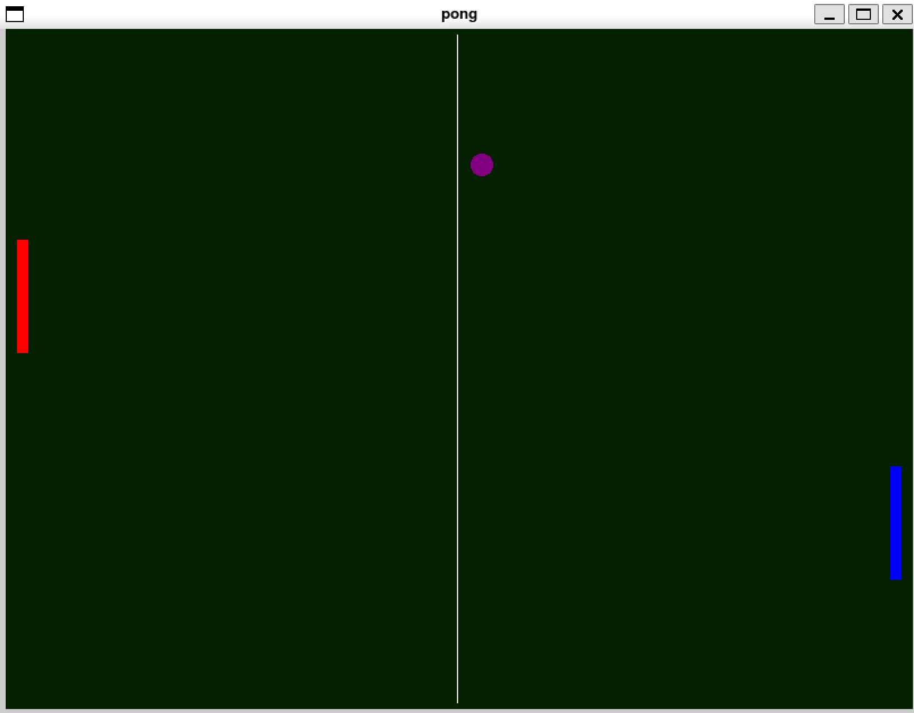

#+TITLE: pong.asm

The classic pong game written with fasm.

THIS IS STILL IN DEVELOPMENT!

* References
- [[https://flatassembler.net/docs.php?article=manual#1.2.1][FASM reference]]
- [[https://en.wikipedia.org/wiki/Pong#In_popular_culture][Pong on Wikipedia]]
- [[https://github.com/raysan5/raylib][raylib]]
- [[https://github.com/tsoding/fasm-raylib-simd][Tsoding on raylib with fasm]]
- [[https://www.cs.uaf.edu/2017/fall/cs301/lecture/10_02_float_asm.html][Floating point operations]]
- [[https://faydoc.tripod.com/cpu/jbe.htm][Jump instructions]]
- [[https://www.felixcloutier.com/x86/cvtss2sd][Promoting float to double]]
- [[https://en.wikipedia.org/wiki/.bss][The BSS segment]]

* Usage
** Get the build tools
#+BEGIN_SRC bash
  # On Debian based distributions
  sudo apt install git fasm make

  # On Arch based distributions
  sudo pacman -S fasm make
#+END_SRC

** Get the repository
#+BEGIN_SRC bash
  git clone https://github.com/SubramanyaJ/pong.asm.git
#+END_SRC

** Build and run
#+BEGIN_SRC bash
  cd pong.asm
  make
  ./pong
#+END_SRC

** Controls
- 'w' and 's' keys for the left paddle.
- Up and down arrows for the right paddle.
- Hit ESC key to quit.
